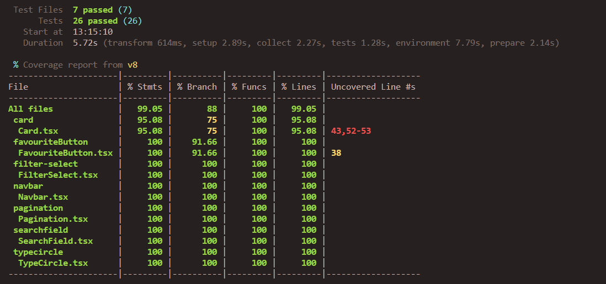

# IT2810 Prosjekt 1

Here is a link to the project: https://gitlab.stud.idi.ntnu.no/it2810-h23/Team-15/prosjekt-1/

This is group 15s submission for project 1 in the course IT2810.

The application is a tool for gathering information about pokemons. You can find different pokemon by navigating through pages, filter by color or a search by specific name or pokedex-number. The information shown about a pokemon includes statistics such as height, weight, abilities, types and other base statistics, as well as an image of the pokemon.

You can also favourize a pokemon by clicking a star button, for providing easier access through the favourites-page later on.

## Installation

1. Clone the repository
2. Run `npm install` in the root folder
3. Run `npm run dev` in the root folder

## Linting

We use eslint to lint our code. To run the linter, run `npm run lint` in the root folder.

## Testing

We used vitest for DOM, snapshot and Unit-testing. To run the tests, run `npm run test` in the root folder.
To check the test-coverage, run `npm run coverage` in the root folder.

As shown below in the coverage report, we have 26 tests and 7 files. Each file is correspondent to a component to be tested and we have tested the following components, with the described tests:

- Card
  - Snapshot test
  - Renders pokemon name and number
  - renders pokemon image
  - navigates to pokemon page on click
- FavouriteButton
  - Snapshot test
  - Renders component
  - Adds pokemon to favourites on click
  - Changes style on click
- Filter-Select
  - Snapshot test
  - Render test
  - Can change option
- Navbar
  - Snapshot test navbar
  - Render test
  - Navigate to home
  - Navigate to favourites-page
- Pagination
  - Snapshot test
  - Render test
  - Navigate to next page
  - Navigate to previous page
- Searchfield
  - Snapshot test
  - Render test
  - Change textfield value
  - Correct navigation on search submit
  - Case sensitivity test



## API-usage

The Restful API we chose for the project is called [PokeAPI](https://pokeapi.co/docs/v2). This API provides easy access to statistics for pokemons.

When we get pokémons on the home page with no filters applied, the API call is as follows:

```
https://pokeapi.co/api/v2/pokemon?limit={resultsPerPage}&offset={pageNumber - 1}
```

Then for each of the pokémons, we have to call on the API to get the data for the pokémon to display on the card component. The API call is as follows:

```
https://pokeapi.co/api/v2/pokemon/{pokemonName or pokemonID}
```

### Sorting

We realised that the API we used offered minimal support for filtering and sorting, so we had to do it by ourselves.

To be able to sort on the pokedex number of a pokémon, we store the pokedex number in a list in local storage. When we get the pokémons from the API, we sort them by the pokedex number in the list. This is done both ascendingly and descendingly. Then each card component has to call on the previous API endpoint.

### Filtering

However, when we want to filter on color, we have to do it by ourselves. We do this by first calling on the API to find all pokémon species that are of a certain color. Then we call on the API to get the data for each of these species. This is done by using the species url that is provided in the first call. Then, each card component has to call on the API to get the data for the pokémon it is supposed to display. This is done by using the url that is provided in the second call. Due to all this logic, having 20 results per page and filtering on color will produce a lot of API calls which we can't avoid.

The API calls are as follows:

```
https://pokeapi.co/api/v2/pokemon-color/{colorName}
```

Then for each of the pokemon species, we have to call on the API to get the data of all their varieties. This will only be done on the amount of species we need, so if there are 20 results per page it will be done on 20 species. The API call is as follows:

```
https://pokeapi.co/api/v2/pokemon-species/{pokemonSpeciesName}
```

Then for each of the pokémons we want to display, we must do the previously mentioned API call to get the data for the pokémon. The API call is as follows:

```
https://pokeapi.co/api/v2/pokemon/{pokemonID}
```

As a side note, we thought we could save ourselves some API calls by assuming the name of the pokémon species is the same as the pokémon name. This is not the case, as seen in the example where Aegislash is a species but the variants of the species are Aegislash Shield and Aegislash Blade. Trying to do an API call on "aegislash" alone would produce an error.

### Search

The API also does not have support for search, so we solved this by making the search field navigate the user to `/pokemon/{pokemonName}`. This will make the page `PokemonPage.tsx` do an API call on the following endpoint:

```
https://pokeapi.co/api/v2/pokemon/{pokemonName}
```

If the user searches for a pokémon that does not exist, the page will display an error message. However, if the user searched for an existing pokémon such as "pikachu", the page will display the data for Pikachu.
